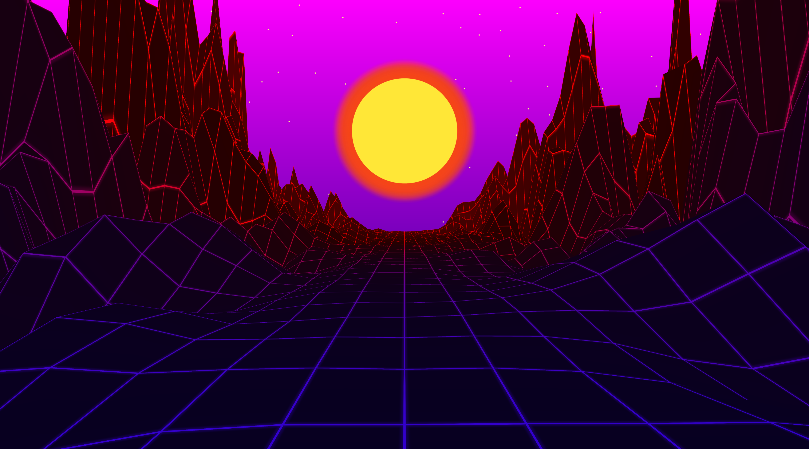

# AestheticTerrain documentation

This document contains the rough overview of what this program can do
and how to control the various features it can offer. It is split into two parts.
Firstly, there is the documentation for the end user, which explains how the user
can take advantage of the various features present in the program. Secondly, there
is the programmer documentation for someone who wants to go through the code and
change it.

## Program result example

This is the type of image that can be created using this program:

## User Documentation

### Usage Instructions

This repository contains a finished build, which should be executable out of the box,
provided the user had .NET 5.0 installed on their machine. It can 
be downloaded from: https://dotnet.microsoft.com/download/dotnet/5.0.

Another option is to
create a build from source, using Visual Studio 19. When using VS, please insure you have .NET 5.0
installed for development. After building, copy the `Assets` directory into the directory where
the resulting `.exe` file is located so that it has access to all the necessary additional files.

### Graphical interface

The program has just one main graphical window, which is split into four main parts.

The first part is the preview section, that is the place where you can check out the image
that is generated from the currently specified parameters.

The second part is the actual options menu. It is split into three cards. On the first card
it is possible to change the various general image options. The second card contains the
options for controlling the terrain. The third card contains options that control the look
of the background. All the options will be discussed more in-depth later.

The third part is the log box which should show the text output of the various operations.
Admittedly, I have neglected this feature due to time constraints, but it will get better
in the future.

The fourth part is the main and most influential controls of the entire application.
The "Render Preview" button triggers the rendering of the preview image.
The "Render Image" creates a dialog for selecting the image destination directory
and then renders the image with the specified parameters to that directory.
The "Save Preset" button saves the complete current parameter state into a plain-text file.
The "Load Preset" button loads all the state parameters into the program.

Finally, I'd also like to mention the top menu bar. It is unfortunately not implemented yet,
and as such, it will do nothing.

### Command line

The program also has limited options for rendering the image while working with the command line.
It is possible to specify a `.ats` file as a parameter, which is then rendered into an image as
per the options contained within that file. The image is saved into the working directory of the program,
i.e. to the `pwd` from which it is called.

**Please note** that running the program in this mode unfortunately still requires the user bo be running
in graphical mode on their machine, because the rendering still happens via OpenTK.

### The Options

Almost every part of the image generated by this program is editable via options.
The resolution, image name and type can be changed.
The colour of the sun, terrain, stars and their glow is editable. Sun and star (and their respective glows) also have
editable radii. The look of the terrain can be influenced by Perlin noise and the 2D Quadratic function.
Star count and distance can also be edited.
All the options are fairly clearly labelled directly in the application.

Additional notes:
- The image resolution unfortunately can't be set completely freely. There is a hard cap set by the monitor resolution
used on the machine which is running the program.

## Programmer's Documentation

### Architecture discussion

The program is designed in a very strange way to accommodate a few requirements.
Firstly, I wanted everything to be contained in a single window to spare the user the suffering
of having to deal with multiple windows. Secondly, I wanted to avoid having to write everything related to
3D graphics from the ground up on the CPU when we have perfectly good tools for the job, such as OpenGL.

The compromise I have chosen is that the program is running an invisible OpenTK `GameWindow` "next" to the main window,
which acts as the target for rendering the terrain. The program flow acts approximately like this: the user clicks the render button,
the background gets rendered(on the CPU), the terrain gets generated, both get sent to the GPU and rendered onto an invisible
window, the framebuffer is harvested into a `Bitmap` and then either displayed in the main window or saved to a file.

### Technologies used

I have used OpenTK (https://opentk.net/) for the various 3D Graphics related parts of the code.
The rest is stock .NET 5.0 and C#.

### Classes

The actual program architecture is fairly simple. The two most important classes are
`MainWindow` and `Renderer`.
The main reason why I split the generators(`TerrainGenerator` and `BackgroundGenerator`) from the Renderer was to avoid having
too many properties in a single class. Another reason was to enable myself to shorten the property names to
avoid the Enterprise Java-esque hellscape of 50 character variable(property, class etc.) names.

All the other classes are mostly various helpers or additional functionality functions that didn't necessarily
have to be in their own classes, but I have to decided to split the off to improve legibility of the code.
Mostly things like `RejectionSampler`, `PerlinNoise`, `Serializer`, `Utils`.

I hope that the code is fairly legible and mostly self-documenting, so I'm going to be brief in the class descriptions and mostly
describe their high-level functionality 

#### MainWindow

This is a standard WinForm class with a lot of components to accommodate all the options that the user is given to manipulate the
resulting image. While the program is running in GUI mode, it also controls the program flow through the component events.
It also holds the instances of `Renderer`, `TerrainGenerator` and `BackgroundGenerator` with updated settings for image generation.

#### Renderer

This class is a wrapper for most of the direct OpenTK functionality, its instance holds a `GameWindow` and other parameters
regarding OpenGL so that it doesn't have to be controlled directly from the main form.

#### TerrainGenerator

This class is very short, it is pretty much just a wrapper for a single function with a lot of parameters, which I didn't want to
store directly in the main form class or in the renderer class to avoid unnecessary clutter. Its main and only job is to generate a
terrain `Mesh`, which is then passed to the renderer to be displayed on the image.

#### BackgroundGenerator

This class is very similar to the class before it. It mostly serves as a wrapper for the function that generates the background
image that gets passed to the renderer.

#### Serializer

This is the wrapper for Reflection functionality, which I have used to serialize and deserialize the program without having to write
out everything by hand. The fortunate side-effect(I actually chose this by design) of this approach is that the resulting serialized
file is still pretty much legible.

#### OpenGL Wrapper Classes

This includes `Shader`, `Mesh`, `Texture` and `Camera`(well, not this one exactly, but the description fits as well).
These classes would truly show their worth in larger and more complicated application, but here, they're present mostly
so I can use certain parts of the OpenGL pipeline without having to write out all the calls directly and risking making
a dumb mistake that takes hours to find and fix.

#### PerlinNoise, RejectionSampler and Quadratic2D

These classes function as wrappers for certain mathematical functionality that I required(continuous good looking noise,
randomly sampling with a minimum distance and a 2D quadratic function).
They could've been in a single file called something like `ATMath` or something, but I have kept them
like this so that I can easily reference them in my future projects.

#### Utils

This class is an assortment of certain Extension methods and other functionality that didn't deserve its own file.