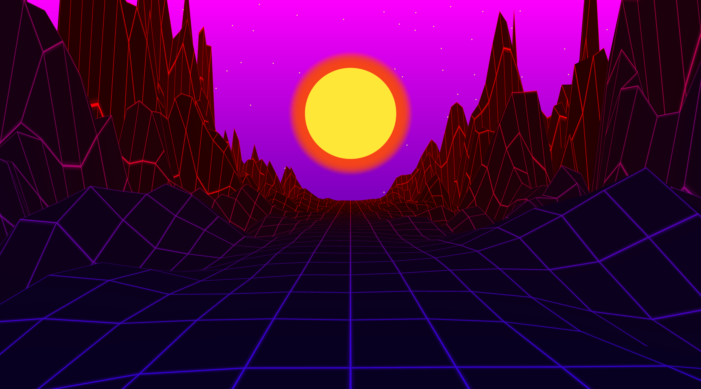
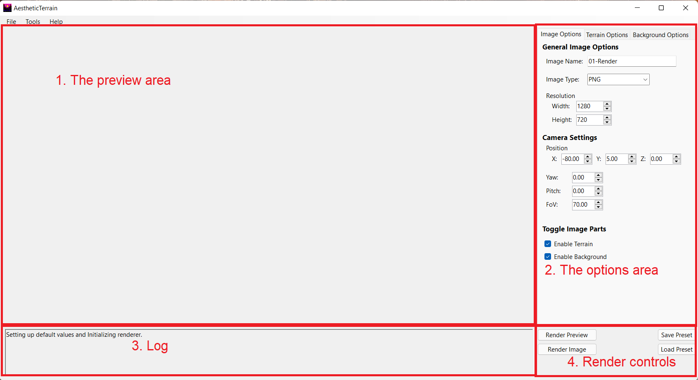

# AestheticTerrain documentation

This document contains the rough overview of what this program can do
and how to control the various features it can offer. It is split into two parts.
Firstly, there is the documentation for the end user, which explains how the user
can take advantage of the various features present in the program. Secondly, there
is the programmer documentation for someone who wants to go through the code and
change it.

## Program result example

This is the type of image that can be created using this program:

## User Documentation

### Usage Instructions

This repository contains a finished build, which should be executable out of the box,
provided the user had .NET 5.0 installed on their machine(it can 
be downloaded from: https://dotnet.microsoft.com/download/dotnet/5.0). Another option is to
create a build from source, using Visual Studio, it should just be the case of opening
the `.sln` file, waiting a little bit and then hitting the Build and Run button.

### Graphical interface

The program has just one main graphical window, which is split into four main parts.

The first part is the preview section, that is the place where you can check out the image
that is generated from the currently specified parameters.

The second part is the actual options menu. It is split into three cards. On the first card
it is possible to change the various general image options. The second card contains the
options for controlling the terrain. The third card contains options that control the look
of the background. All the options will be discussed more in-depth later.

The third part is the log box which should show the text output of the various operations.
Admittedly, I have neglected this feature due to time constraints, but it will get better
in the future.

The fourth part is the main and most influential controls of the entire application.
The "Render Preview" button triggers the rendering of the preview image.
The "Render Image" creates a dialog for selecting the image destination directory
and then renders the image with the specified parameters to that directory.
The "Save Preset" button saves the complete current parameter state into a plain-text file.
The "Load Preset" button loads all the state parameters into the program.

Finally, I'd also like to mention the top menu bar. It is unfortunately not implemented yet,
and as such, it will do nothing.

### Command line

The program also has limited options for rendering the image while working with the command line.
It is possible to specify a `.ats` file as a parameter, which is then rendered into an image as
per the options contained within that file. The image is saved into the working directory of the program,
i.e. to the `pwd` from which it is called.

**Please note** that running the program in this mode unfortunately still requires the user bo be running
in graphical mode on their machine, because the rendering still happens via OpenTK.

### The Options

Almost every part of the image generated by this program is editable via options.
The resolution, image name and type can be changed.
The colour of the sun, terrain, stars and their glow is editable. Sun and star (and their respective glows) also have
editable radii. The look of the terrain can be influenced by Perlin noise and the 2D Quadratic function.
Star count and distance can also be edited.
All the options are fairly clearly labelled directly in the application.

Additional notes:
- The image resolution unfortunately can't be set completely freely. There is a hard cap set by the monitor resolution
used on the machine which is running the program.